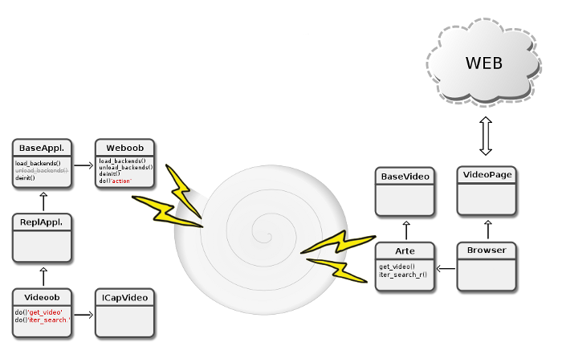

Overview
========

Weboob (Web Outside Of Browsers) provides:

* :doc:`applications <api/tools/application/index>` to interact with websites
* :doc:`modules </guides/module>`, each one handles a specific website
* a :doc:`core library <api/core/index>` providing all the features needed by backends
* :doc:`tools <api/tools/index>` to help develop backends and applications

Weboob is written in Python and is distributed under the AGPLv3+ license.

Architecture
------------

.. warning::
   This diagram has to be redrawn.

Capabilities
------------

The core library defines capabilities. They represent features common to various websites.
For example, http://www.youtube.com and http://www.dailymotion.com are both videos
providers: Weboob defines the ``CapVideo`` capability.

Each module interfaces a website and implements one or many of these
capabilities. Modules can be configured, which means that the end-user can
provide personal information to access the underlaying website (login/password
for example). We call a configured module a Backend.

Multi-backend call
------------------

The core library provides a mechanism allowing applications to call many backends in
parallel, in a multi-threaded way.

For example, one could search a video on many providers websites.

Applications
------------

Applications are toolkit-agnostic. They can use Gtk, Qt or just be text-only, more adapted to reuse data through pipes.

Reporting a bug
---------------

When you report a bug on the tracker, it's important to correctly set the category as specific as possible.
Also, don't forget to give information about your version of Weboob, OS, implicated libraries.

It is often relevant to use the -d parameter on application to get verbose logs.
